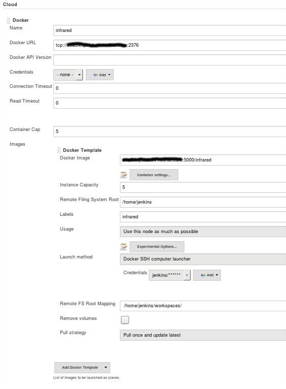

# Deploying OpenStack using containerized infrared
------------------------------
## Setting up jenkins

* Install docker plugin
* Setup new cloud in Jenkins setting page

	
* Assign label to the newly created slave
* Configure the job to run on docker slave

## Create docker image for jenkins slave

* Clone [repo](https://github.com/ovorobio/infrared-docker.git) with ansible tasks for build docker container
* Inside the repo run `ansible-container build`
* Tag the image with proper tag that describes the docker registry.
* After the image is created upload it to the registry with `docker push` command
* Download the image to the host where docker slave will be executed with `docker pull` command
